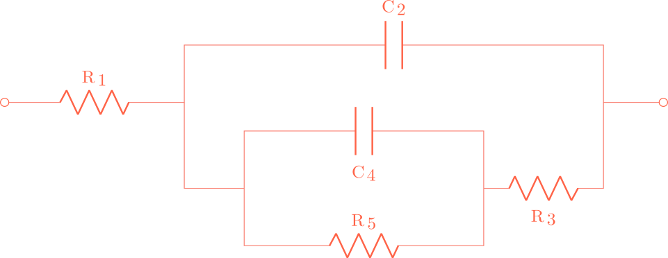

# EquivalentCircuits.jl

This Julia module allows users to analyse their **electrochemical impedance spectroscopy** (EIS) data using **equivalent electrical circuits**. EquivalentCircuits.jl can be used to either fit the parameters of a given equivalent electrical circuit , or to get recommendations for an appropriate equivalent electrical circuit configuration. The latter is done by conducting an automatic literature search, where the compatibility of impedance measurements with a variety of equivalent circuits from the EIS literature is evaluated. Alternatively, a [gene expression programming](https://en.wikipedia.org/wiki/Gene_expression_programming)-based approach can be used to algorithmically search for compatible circuits.

## Installation
The package can be installed using the package manager.
```julialang
] add EquivalentCircuits
```

## Usage
### Circuit notation
Equivalent electrical circuit models are composed of electrical elements, connected in series or in parallel. The four fundamental elements that are most commonly encountered in equivalent electrical circuits, are resistors, capacitors, inductors and constant phase elements. These four elements are represented by the capital letters R, C, L and P, respectively. serially connected elements have dashes between them, wereas parallely connected elements are placed between square brackets and separated by a comma. Finally all the elements in a circuit are numbered. Using these notation rules, the circuit `R1-[C2,R3-[C4,R5]]` corresponds to:



When using this package, the circuit should input as a String:  
```julia
using EquivalentCircuits

circuit = "R1-[C2,R3-[C4,R5]]"
```

### Parameter fitting
When an appropriate circuit model is available, the parameters can be fitted to experimental data using the `parameteroptimisation` function which accepts two arguments:
- `circuit` : the equivalent circuit, provided as a string with the circuit notation displayed above.
- `data` : the filepath of the electrochemical impedance measurement data.
The data should be provided as a CSV file with three columns: imaginary impedance, real impedance and frequency (see example_measurements.csv).

Lets first take a look at what the çontents of the [example_measurements.csv](https://github.com/MaximeVH/EquivalentCircuits.jl/blob/master/example_measurements.csv) file look like:

```julia
using CSV, DataFrames

#Load the measurement data.

data = "example_measurements.csv"; #This should be the filepath of the example_measurements.csv file.

df = CSV.read("example_measurements.csv",DataFrame,header = false);

#Rename the columns for illustration purposes.

rename_dict = Dict("Column1"=>"Reals","Column2"=>"Imags","Column3"=>"Frequencies");

rename!(df, rename_dict);

println(df)

```

Next we can fit the parameters of our example ciruit to the example measurement data as follows:
```julia
circuitparams = parameteroptimisation(circuit,data)
```
Some users may find it more convenient to directly input the complex-valued impedance measurements and their corresponding frequency values to the function vectors. This is illustrated below.

```julia
measurements = [5919.90 - 15.79im, 5919.58 - 32.68im, 5918.18 - 67.58im, 5912.24 - 139.49im, 5887.12 - 285.74im, 5785.04 - 566.88im, 5428.94 - 997.19im, 4640.21 - 1257.83im, 3871.84 - 978.97im, 3537.68 - 564.96im, 3442.94 - 315.40im, 3418.14 - 219.69im, 3405.51 - 242.57im, 3373.90 - 396.07im, 3249.67 - 742.03im, 2808.42 - 1305.92im, 1779.41 - 1698.97im, 701.96 - 1361.47im, 208.29 - 777.65im, 65.93 - 392.51im]

frequencies = [0.10, 0.21, 0.43, 0.89, 1.83, 3.79, 7.85, 16.24, 33.60, 69.52, 143.84, 297.64, 615.85, 1274.27, 2636.65, 5455.59, 11288.38, 23357.21, 48329.30, 100000.00]

circuitparams = parameteroptimisation(circuit,measurements,frequencies)
```
### Circuit literature search
The compatibility of a given set of impedance measurements with circuits from similar applications is evaluated with the `circuit_search(data,domain;kwargs)` function.  Users can finetune the search by restricting the complexity and element composition of the returned circuits. The function returns the compatible circuits along with their Digital Object Identifier (DOI) so that users can examine the circuits' other uses to further evaluate its suitability. An overview of the function's inputs is provided below:

- `data` : A CSV filepath to the measurements with their frequency information.
- `domain` : The application. The supported applications are:  "Animals",  "Plants",  "Biosensors" , "Batteries", "Fuel_cells" , "Supercapacitors",  and  "Materials".
- `terminals`  : (optional) the circuit components that are to be included in the circuit identification.
- `max_complexity`  : a hyperparameter than controls the maximum considered complexity of the circuits.

### Circuit fitting
When only the electochemical impedance measurements are available, equivalent electrical circuit recommendations can be also be obtained using the `circuit_evolution(data;kwargs)` function. The data can once again be provided as a CSV file's filepath. A variety of keyword arguments can be adjusted to fine-tune the gene expression programming circuit identification procedure.The possible keyword agruments to tune the cirucit identification are:

- `generations` : the maximum number of algorithm iterations.
- `population_size` : the number of individuals in the population during each iteration.
- `terminals` : the circuit components that are to be included in the circuit identification.
- `cutoff`: a hyperparameter that controls the circuit complexity by removing redundant components. Lower values lead to more simple circuits, however too low values will lead to circuits that no longer fit the measurements well.
- `head` : a hyperparameter than controls the maximum considered complexity of the circuits.
- `initial_population` : the option to provide an initial population of circuits with which the algorithm starts.

The defaults values are as follows:


| Argument      | Default value |
| ----------- | ----------- |
| generations      | 10       |
| population_size   | 30        |
| terminals   | "RCLP"        |
| head   | 8        |
| cutoff  | 0.80     |
| initial_population  | nothing      |

As an example, by running the code below you can see if a circuit can be found, consisting of only resistors and capacitors, that is capable of fitting the example measurement data. The `data` argument is the filepath of the [example_measurements.csv](https://github.com/MaximeVH/EquivalentCircuits.jl/blob/master/example_measurements.csv) file.

```julia
circuit_evolution(data,terminals="RC")
```
Alternatively, this function can also accept the measurements and frequencies as vectors, rather than a CSV file:

```julia
circuit_evolution(measurements,frequencies,terminals="RC")
```

Next, the file [Circuitlibrary.csv](https://github.com/MaximeVH/EquivalentCircuits.jl/blob/master/Circuitlibrary.csv) contains a collection of various circuit topologies. We can allow the algorithm to start from this circuit collection as initial population as follows:

```julia
# Load the population from the CSV file, using the loadpopulation function.
# The input of the loadpopulation should be the filepath of Circuitpopulation.csv.
circuit_library = loadpopulation("Circuitlibrary.csv"); #The input should be the filepath of the Circuitlibrary.csv file.

# Now find a circuit that fits the data, starting from the initial population of circuits
circuit_evolution(data,initial_population = circuit_library)

```
